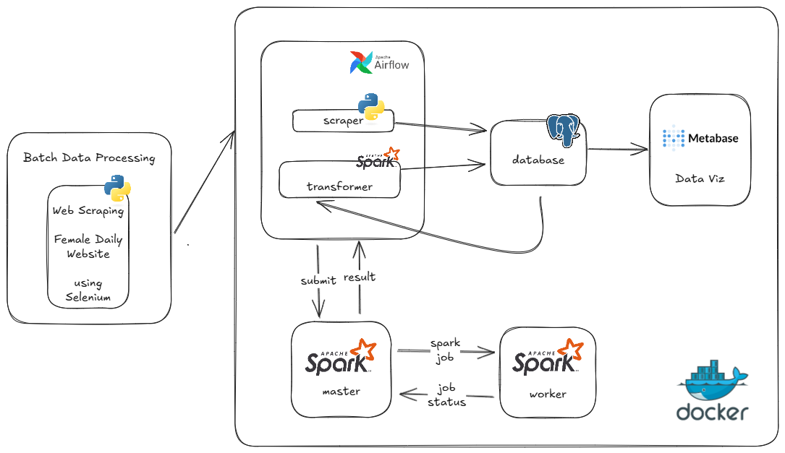

# Data Pipeline for Skincare Product Review

## Project Overview
This project builds an automated data pipeline to scrape, process, and analyze skincare product reviews from the **Female Daily** website. The pipeline is fully integrated within **Docker**, utilizing **Selenium**, **Apache Airflow**, **Spark**, and **Metabase** to automate data collection, transformation, and visualization.

## Project Structure
```
├── dags
│   ├── resources
│   │   ├── scripts
│   │   │   └── scrape.py
│   │   ├── sql
│   │   │   ├── bronze
│   │   │   │   ├── category.sql
│   │   │   │   ├── product.sql
│   │   │   │   ├── review.sql
│   │   │   ├── silver
│   │   │   │   ├── category_transformed.sql
│   │   │   │   ├── product_transformed.sql
│   │   │   │   ├── review_transformed.sql
│   │   │   ├── gold
│   │   │   │   ├── dim_category.sql
│   │   │   │   ├── dim_product.sql
│   │   │   │   ├── dim_review.sql
│   │   │   │   ├── fact_product_review.sql
│   ├── scrape_product_dag.py
│   ├── transform_data_dag.py
│   ├── gold_layer_dag.py
│
├── docker
│   ├── docker-compose-airflow.yml
│   ├── docker-compose-postgres.yml
│   ├── docker-compose-spark.yml
│   ├── docker-compose-metabase.yml
│   ├── Dockerfile.airflow
│   ├── Dockerfile.spark
│
├── jars
│   ├── postgresql-42.2.18.jar
│
├── scripts
│   ├── entrypoint.sh
│   ├── metabase_create_conn.sh
│   ├── metabase_entrypoint_wait.sh
│   ├── metabase_entrypoint.sh
│
├── sql
│   ├── warehouse-setup.sql
│
├── Makefile
```

## Data Pipeline Workflow



1. **Scraping (Bronze Layer):**
   - Uses **Selenium** to scrape skincare product data and reviews.
   - Stores raw data in PostgreSQL.
   - Managed by `scrape_product_dag.py` in **Apache Airflow**.

2. **Transformation (Silver Layer):**


   - Cleans and structures raw data using SQL transformations.
   - Converts unstructured text into structured format.
   - Managed by `transform_data_dag.py`.

3. **Data Warehouse (Gold Layer):**


   - Aggregates and organizes data into **dimensional models**.
   - Creates fact and dimension tables for analysis.
   - Managed by `gold_layer_dag.py`.

4. **Visualization:**
   - Uses **Metabase** to create dashboards for insights on product trends and reviews.

## Dashboard & Reporting
The dashboard is built using **Metabase** and includes several charts to analyze skincare product reviews:

- **Overall Performance:** Total products, total categories, and total reviews.
- **Review Breakdown:**
  - Review per **undertone** (cool, warm, neutral).
  - Review per **skin tone** (dark, light, medium).
  - Review per **skin type** (dry, normal, oily, combination).
  - Review per **usage period**.
  - Review by **rating**.
  - Review per **reviewer age**.
- **Top Products Analysis:**
  - **Top products by rating per category**.
  - **The cheapest high-rated (rating > 4.5) product per category**.
- **Filtering Options:**
  - **Platform:** E-commerce, supermarket, event, website.
  - **Skin Type:** Dry, normal, oily, combination.
  - **Skin Tone:** Dark, light, medium.
  - **Undertone:** Cool, warm, neutral.
  - **Date Filter:** Select time range for analysis.

## Technologies Used
- **Selenium** – Web scraping
- **Apache Airflow** – Workflow orchestration
- **Apache Spark** – Data processing
- **PostgreSQL** – Data storage
- **Metabase** – Data visualization
- **Docker** – Containerization

## Setup & Deployment
### 1. Clone Repository
```bash
git clone <repo-url>
cd <repo-folder>
```

### 2. Build and Run Docker Containers
```bash
make docker-build
make all
```

### 3. Run Airflow DAGs
- Access Airflow UI at `http://localhost:8080`
- Enable and trigger:
  - `scrape_product_dag`
  - `transform_data_dag`
  - `gold_layer_dag`

### 4. Access Metabase
- Go to `http://localhost:3000`
- Configure PostgreSQL connection using `scripts/metabase_create_conn.sh`
- Create and explore dashboards

## Makefile Commands
The project includes a `Makefile` to simplify Docker container management. Below are some useful commands:

```bash
make docker-build     # Build all Docker images
make postgres         # Start PostgreSQL container
make airflow          # Start Airflow scheduler & webserver
make spark            # Start Spark cluster
make metabase         # Start Metabase for visualization
make all              # Run all services (PostgreSQL, Airflow, Spark, Metabase)
make postgres-bash    # Access PostgreSQL container shell
make give-all-permission # Set necessary file permissions
```

## Future Improvements
- Implement sentiment analysis on reviews.
- Enhance data enrichment with additional sources.
- Optimize scraping process for scalability.

---
**Author:** Isyafira